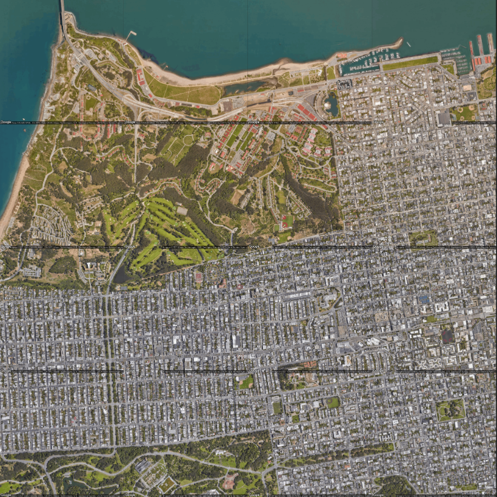

# Tiling the Google Static Maps API.

> This Python script produces satellite images than can be tiled together to cover a larger area. Any improvements very welcome!

## Inputs

You can see all the inputs this API takes and explanation of those listed below, [here](https://developers.google.com/maps/documentation/maps-static/start).

### Script variables
* areaID - For your use only, to used as part of the file name for future reference
* northWestLat etc - These are the coordinates of the area you would like to "scan". Essentially, the top left and bottom right corners

### API parameters
As mentioned previously, a much more detailied descriptions of the parameters can be found in the [documentation](https://developers.google.com/maps/documentation/maps-static/start#location). The ones I use in this script are:
* api_key - You need one of these to use any Google API, paste yours at this variable as a string! If you're reading this, you probably already have one. If not, you can get one [here](https://developers.google.com/maps/gmp-get-started).
* zoom - Used to set the zoom of your request according to [these values](https://developers.google.com/maps/documentation/maps-static/start#Zoomlevels). Also used to calculate xScale and yScale which are used to determine the "step" needed for the request for the next tile.
* picHeight/Width - The size (in pixels) you want your request to be. If you set your scale as 2, it will be twice this. See [here](https://developers.google.com/maps/documentation/maps-static/start#Imagesizes) for more info.
* scale - Can only be 1 or 2. See [here](https://developers.google.com/maps/documentation/maps-static/start#scale_values).
* maptype - Satellite/ hybrid etc. See [here](https://developers.google.com/maps/documentation/maps-static/start#MapTypes) for options!

## Why does this exist
I'm currently working on my final year dissertation for university. I'm creating a dataset where I need to be able to find the elevation data for each pixel of a satellite image. Finding the elevation from a Lat Long coordinate is [easy](https://developers.google.com/maps/documentation/elevation/start). Finding the Lat Long of a given pixel from a Google Static Maps request? Not so easy.

This script serves a more general purpose of finding the coordinates of the next request to ensure all pictures tile together correctly with no gaps or overlaps. Below is an example of running this script for an area of San Francisco:

You can see they all line up as shown below:

Using the functions in this script you can convert any Lat Long to a google pixel value and vice versa. This can then be used to find the corners of the image, find the Lat Long of any given pixel in the image, tile the images (as in this script) or anything else.

The resulting images still contain the google copyright marks. I've kept these in but if you wanted to remove them, you could work out a way of doing so using the functions available. The bottom of the image would need to be cut off and the "step" downwards to the next request should be updated accordingly (if you wish to maintain the tiling property).

:star2: Please star if you found this useful :)
